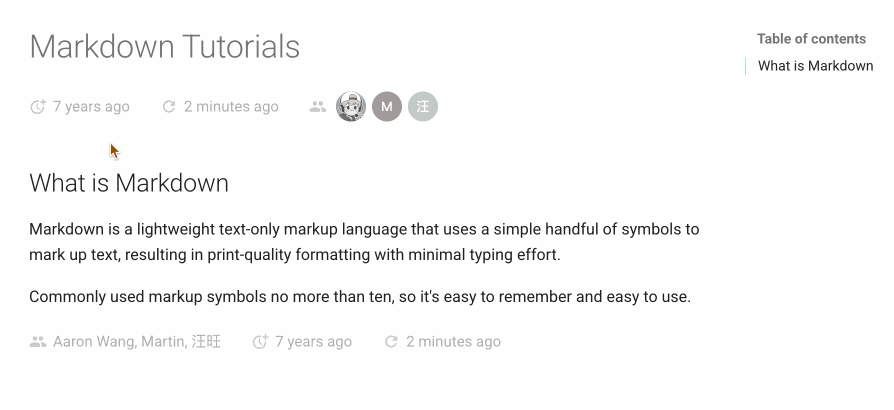

# 实用的 MkDocs 插件 - 显示准确文档日期

[mkdocs-document-dates](https://github.com/jaywhj/mkdocs-document-dates)：一个用于显示文档的<mark>准确</mark>创建时间、最后更新时间及作者信息的 MkDocs 插件。相比 mkdocs-git-revision-date-localized-plugin，这个适用于任何环境，支持在 Front Matter 中手动指定时间和作者信息，跨平台，轻量级，简单易用。

- 始终显示文档的准确元信息，适用于任意环境（无 Git、Git 环境、所有 CI/CD 构建系统等）
- 支持在 `Front Matter` 中手动指定时间和作者
- 支持多种时间格式（date、datetime、timeago）
- 灵活的显示位置（顶部或底部）
- 支持 Tooltip 悬浮提示
- 支持多语言、跨平台

