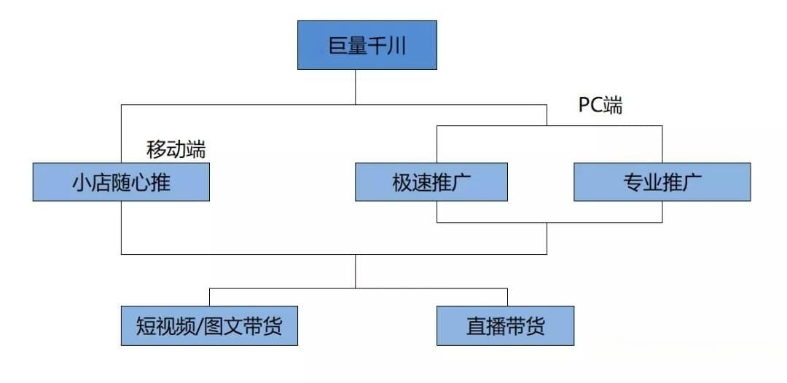

# 直播运营

## 直播间推广

### 基础定向
- **地域**：一般排除客户不发货的地区（居住在该地区的人群）
- **性别**：除非特殊原因，根据目标用户选择
- **网络**：WIFI + 5G + 4G + 3G

### 徕卡定向

- **电商互动行为**：15天内
- **行为类目词**：3个左右，强相关1个 + 2个次相关
- **行为关键词**：强相关 + 次相关的类目词 + 强相关 + 次相关的产品词
- **兴趣类目词**：只写强相关类目
- **兴趣关键词**：选择强相关的类目词 + 强相关产品的词

### 达人定向

- **达人数量**：30个达人都需要写满
- **定向人群**：需要受访的人群比头部商家要好
- **带货号选择**：尽量找同类货号，并非“网红”或“强人设账号”

### 智能放量

- **前期**：没模型的时候尽量不开
- **后期**：可只开行为兴趣放量

### 流量池及标签

- **前期**：强相关流量池
- **潜力池**：根据人群画像可延伸潜力池
- **小众流量池**：尝试小众竞争小的池子可能效果更好
- **标签**：20个要写满，10个强相关产品词 + 同行大品牌名 + 实时热点词（不超过2个），材质、面料、感受、季节等都可以

### 视频思路

- **产品展示**（真人实拍）+ 口水情歌BGM 无口播
- **产品展示**（真人实拍）+ 使用场景模拟BGM 无口播
- **产品展示**（真人实拍）+ 情感鸡汤文案 无口播

### 巨量千川广告投放小TIPS

- **成单计划**：高预算更可能起量
- **勤奋**：每天都直播，时长越长，效果越好
- **OCPM设置**：可以尝试自动出价，但一定要卡住预算，盯住消耗
- **预期管理**：投放初期尽量以起量和抓到人群为主要目标
- **灯光**：对于作品类的影响很大
- **对标账号**：多找对标账号（并非头部账号），录屏、复刻、练习、集百家之长，才能成就自己
- **单品直播**：平摊效果不好的时候试试单品直播
- **持续直播**：不要经常断播，三天打鱼两天晒网基本不会成功
- **巨量千川**：尽量投专业版

## 巨量AD与千川投放区别

- [参考1](https://www.zhihu.com/question/481468492)
- [参考2](https://www.bilibili.com/opus/781362376529149959)

### 属性定义

- 巨量引擎广告投放平台，又称AD平台，是聚合抖音、今日头条、西瓜视频等产品的官方营销服务品牌，帮助广告主自助投放广告，高效达成营销推广日标，适合宣传、信息收集、需要二次动作才可促成成交的场景，有无店铺均可
- 巨量千川，是巨量引擎旗下的**电商**广告平台，为商家和创作者们提供抖音电商一体化营销解决方案，巨量千川还将抖音店铺、抖音账号和巨量千川账号进行全部打通，一店一号一千川

### 形式区别

- 巨量千川投放直播间，现在只能投小黄车，小风车投放不了。巨量千川需要绑定抖音号，如果你想要去投放成交、投放下单、投放ROI 必须要有商品才可以，除非你不投放商品，只用千川投放加粉互动可以
- 巨量 AD 投放直播间，像小黄车、小风车，还有小雪花、小铃铛、小房子这些都可以去投放的

### 流量区别

- 巨量千川投放直播间，给的流量都是电商流量，更多的是之前在抖音上有过购买行为、或者愿意去购买的人会更多些
- 巨量 AD 投放直播间不止是电商流量，更加偏向于本地或者专业垂直类的，比如小风车游戏类的、小房子这种本地类的会更多些

## 直播组件

### 小黄车

- 售卖商品的购物车，必须要有抖店，考核电商指标，看销量和成交
- 一般用千川或小店随心推进行投放
- 开通条件：
    1. 绑定手机号，完成实名认证
    2. 已发布 10 个以上公开原创视频
    3. 抖音账号达到 1000 粉丝

### 小风车

- 直播卡片，适合以获客留资为目的，不在抖音上达成交易的场景，比如门店引流、APP下载、预约团购等
- 根据热度来推流：观看时长、互动率、转粉率、加粉丝团率等
- 一般用 AD 进行投放，需绑定企业号，巨量 AD 投直播间需要找直客加白申请开通
- 开通条件：
    1. 企业蓝V号，需要营业执照
    2. 需要达到 10000 的粉丝

### 小雪花

- 抖音小程序，根据热度来考核：观看时长、互动率、转粉率、加粉丝团率等，适合知识类博主
- 一般用 AD 进行投放
- 开通条件：
    1. 账号实名
    2. 抖音账号达到 1000 粉丝
    3. 近三十天直播没有违规

### 小房子

- 抖音来客，本地生活团购的直播组件，从小风车升级而来，主要用于团购券/门票类本地生活项目，非常适合本地生活的商家和达人
- 一般用本地推进行投放
- 开通条件：
    1. 账号实名
    2. 抖音账号达到 1000 粉丝
    3. 必须开启团购

### 小铃铛

- 游戏类，用于直播间游戏下载
- 一般用 AD 进行投放

## 直播运营工作项

### 主播管理

- 主播招聘和培训，并为主播做全方位定位和内容策划
- 与主播沟通直播方案、排期，协助主播做好直播的各项准备和应急预案
- 监控主播直播过程，对主播状态进行及时告知和调整
- 管理主播的业绩，发现并提出主播在直播过程中需要改进的地方，提供相应的改进方案，进行激励管理等

### 直播流程策划

- 直播间布置
- 直播风格定位与直播场景优化
- 音乐准备

### 内容运营

- 内容策划，对直播方向进行规划，选择合适的直播主题、商品、主体和品牌等
- 制定直播内容方案，进行玩法策划和脚本策划等
- 审核主播的稿子

### 流量获取

- 了解平台规则
- 进行直播间用户分层
- 粉丝运营，增强粉丝与主播的关系，为主播带来更多粉丝流量，增强粉丝粘性
- 维护直播间的稳定，管理直播间秩序

### 产品运营

- 熟练掌握产品的各方面优点，配合主播进行宣传和展示，以吸引粉丝在直播间下单
- 了解提现流程和分成比例等

### 数据分析

- 监控和分析直播平台的直播数据
- 进行同时间段、同类型主播的数据比较
- 制定合理的指标，对指标进行拆解，撰写分析报告，进行赋能优化