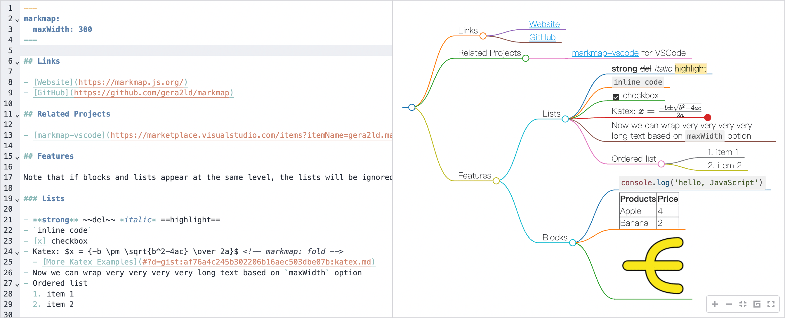
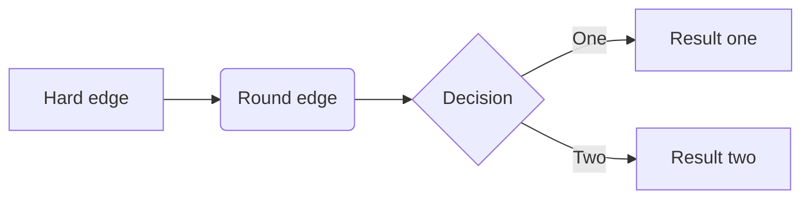
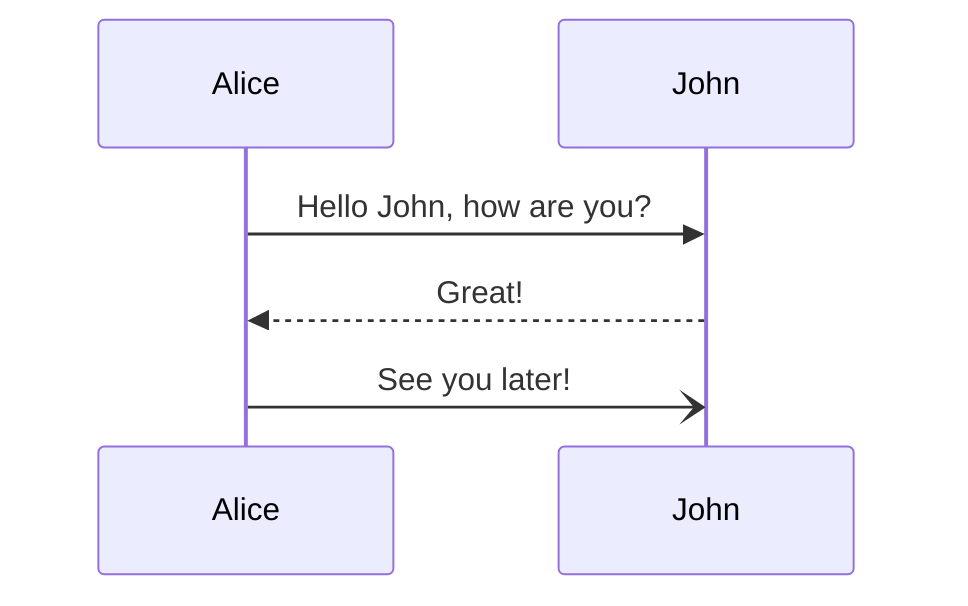
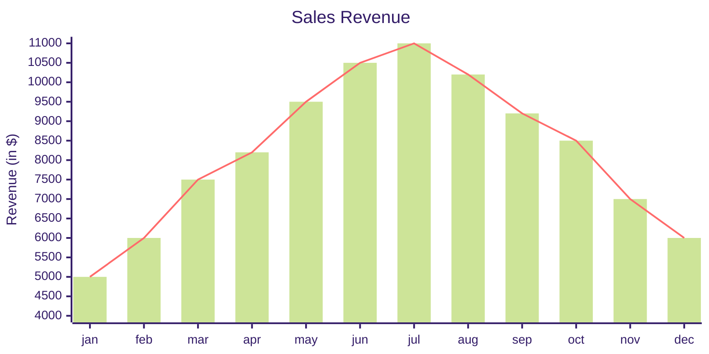
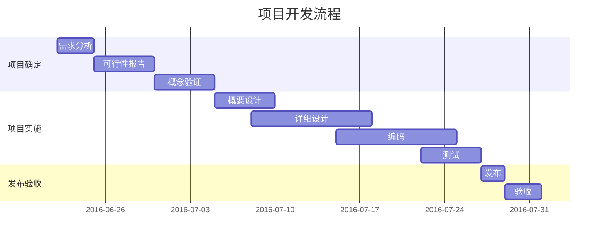
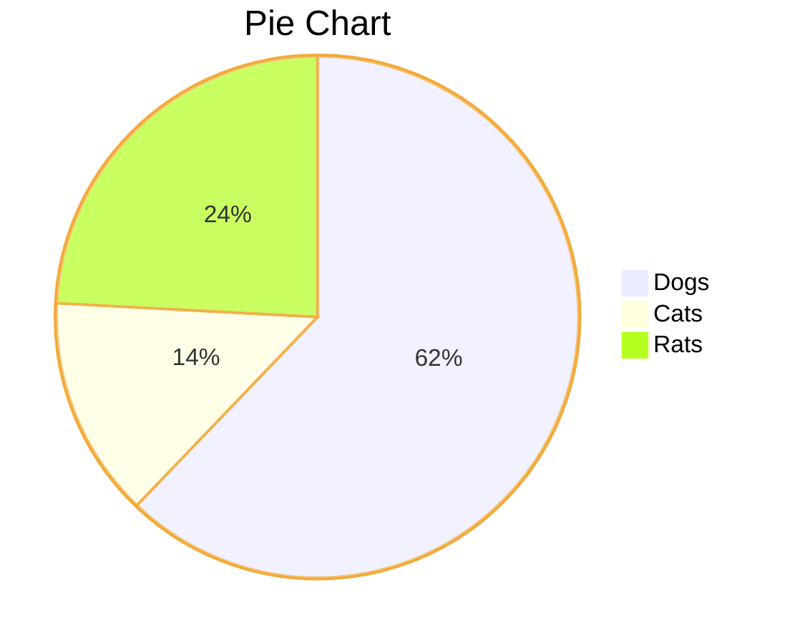
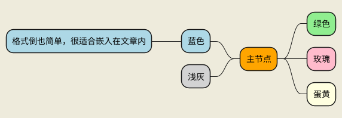

# Markdown图形与图表

使用 Markdown 可快速生成各类图形与图表，如思维导图、UML图、交互式图表等。


## 绘图库

- [markmap](https://markmap.js.org/)，将 Markdown 文本可视化为**交互式**思维导图，[在线编辑](https://markmap.js.org/repl)；✓
- [Plotly](https://plotly.com/graphing-libraries/)，超强**交互式**图表及绘图库，有 Python、R、Julia、JavaScript、ggplot2、F\#、MATLAB 和 Dash 版本，可用于生成交互式的统计图表、3D 图表、科学图表、SVG 和平铺地图、财务图表等；
- [Mermaid](https://mermaid.js.org/)，流行的 JS 绘图库，支持各种UML图和非UML图，使用参考 [Mermaid 中文文档](https://mermaid.nodejs.cn/intro/)；
- [PlantUML](https://github.com/plantuml/plantuml)，老牌绘图库，支持各种UML图和非UML图，使用参考 [PlantUML 中文文档](https://plantuml.com/zh/)；
- [Draw.io](http://draw.io/)，一款非常强大的开源在线绘图神器，还有独立客户端；
- [Chart.js](https://www.chartjs.org/)，一个简单、灵活、时尚的 JS 图表库；
- [Apache ECharts](https://echarts.apache.org/zh/index.html)，一个基于 JS 的开源可视化图表库；
- [ApexCharts](https://apexcharts.com/)，一个时髦 JS 图表库，帮助开发人员为网页创建精美的交互式可视化效果；
- [推荐10个可视化图表](https://github.com/FrontEndGitHub/FrontEndGitHub/issues/73)；


### 编辑器支持

- **Typora**：支持 flowchart.js、js-sequence-diagrams、Mermaid。使用方法见 [Typora 绘图](https://support.typora.io/Draw-Diagrams-With-Markdown/)，如果要修改图表样式见 [图表选项](https://support.typora.io/Diagram-Options/)；
- **MWeb**：支持 Mermaid、PlantUML、ECharts；
- **MiaoYan**：支持 Mermaid、PlantUML、Markmap；
- **YankNote**：支持 Mermaid、Draw.io、ECharts、PlantUML、Markmap；


## 一、markmap 思维导图

使用 [markmap](https://markmap.js.org/)，将 Markdown 文本可视化为交互式思维导图。

<!--  -->
<iframe src="assets/markmap.mm.html" style="width: 100%; height: 50vh;" scrolling="no" frameborder="0" webkitallowfullscreen mozallowfullscreen allowfullscreen></iframe>


### 1. 独立使用

- [在线试用](https://markmap.js.org/repl)；
- command-line：[markmap-cli](https://markmap.js.org/docs/packages--markmap-cli)；✓
- 模板 autoloader：[markmap-autoloader](https://stackblitz.com/edit/markmap-autoloader?file=index.html)；
- MkDocs 插件：[mkdocs-markmap](https://github.com/markmap/mkdocs-markmap)；
- VSCode 插件：[markmap-vscode](https://marketplace.visualstudio.com/items?itemName=gera2ld.markmap-vscode)；
- YankNote 插件：升级到高级版，扩展 markmap 插件后使用；

安装 markmap-cli：

```bash
npm install -g markmap-cli
markmap -h

markmap docs/markmap.md
markmap --no-toolbar docs/markmap.md
markmap --offline docs/markmap.md
markmap -o markmap.html docs/markmap.md
```


### 2. 嵌入使用

- 通过 `<iframe>` 标签嵌入 `markmap-cli` 构建后的 html 文件即可；
- MkDocs 插件 [mkdocs-markmap](https://github.com/markmap/mkdocs-markmap)，可在文档内直接用 `markmap 栅栏块`前后包围某块区域的方式使用，被包含的可以是标题、列表、表格、代码块、复选框、图片等，不局限于列表。也可嵌入整个外部文档，具体参考 [markmap-mkdocs 示例](markmap-mkdocs.md)；
- YankNote 高级版也支持以上方式；


## 二、Plotly 绘图库

MkDocs：[mkdocs-plotly-plugin](https://github.com/legendof-selda/mkdocs-plotly-plugin)，集成了 Plotly.js 的 MkDocs 插件。

### 1. 简单数据

````
```plotly
{
    "data": [
        {
            "x": ["giraffes", "orangutans", "monkeys", "Six", "Ten", "Three"],
            "y": [20, 14, 23, 30, 42, 18],
            "type": "bar"
        }
    ]
}
```
````

```plotly
{
    "data": [
        {
            "x": ["giraffes", "orangutans", "monkeys", "Six", "Ten", "Three"],
            "y": [20, 14, 23, 30, 42, 18],
            "type": "bar"
        }
    ]
}
```

### 2. 从文件加载数据

````
```plotly
{"file_path": "plotly-json/scatter.json"}
```
````

需要 `mkdocs serve` 才可以加载本地文件：

```plotly
{"file_path": "plotly-json/scatter.json"}
```


## 三、Mermaid 绘图

Mermaid 支持 流程图、序列图、类图、甘特图、饼图、象限图、C4图、时间线图、桑基图、框图、数据包图、架构图等…

1. 先声明代码块语言为 mermaid；
2. 再标记 mermaid 图类型；
3. 然后写绘图代码。可使用 [Mermaid 实时编辑器](https://mermaid.live/)。


### 1. 流程图

使用 `flowchart` 或 `graph` 标记：

````markdown

````

效果如下：


### 2. 序列图

使用 `sequenceDiagram` 标记：

````markdown

````

效果如下：


### 3. XY 图

使用 `xychart-beta` 标记：

````markdown

````

<!--v-->

效果如下：


### 4. 甘特图

使用 `gantt` 标记：

````markdown

````

<!--v-->

效果如下：


### 5. 饼图

使用 `pie` 标记：

````markdown

````

<!--v-->

效果如下：


## 四、PlantUML绘图

### 1. 时序图

````markdown
```plantuml
@startuml
skinparam backgroundColor #EEEBDC
!option handwritten true

Alice -> Bob: Authentication Request
Bob --> Alice: Authentication Response
Alice -> Bob: Another authentication Request
Alice <-- Bob: Another authentication Response
@enduml
```
````


### 2. 思维导图

可使用 `+ - *`，行首用缩进或填充的方式都可以。

````markdown

````
