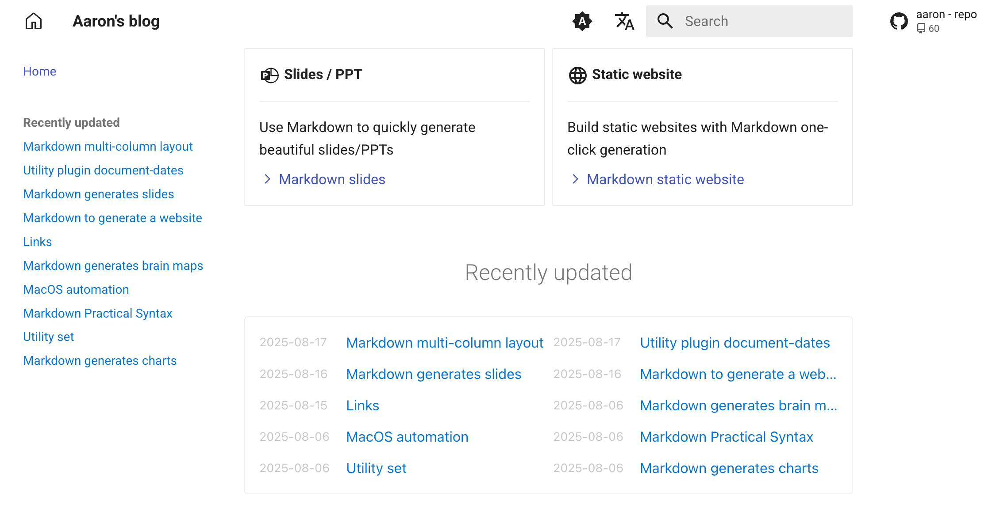

# 最近更新文档列表 - MkDocs 插件

[mkdocs-recently-updated-docs](https://github.com/jaywhj/mkdocs-recently-updated-docs)：一行代码显示最近更新的文档列表

- 按更新时间倒序显示最近更新的文档
- 支持排除指定文件或目录
- 支持自定义显示数量
- 支持自定义渲染模板
- 适用于任何环境（no-Git, Git, Docker, all CI/CD build systems, etc）

