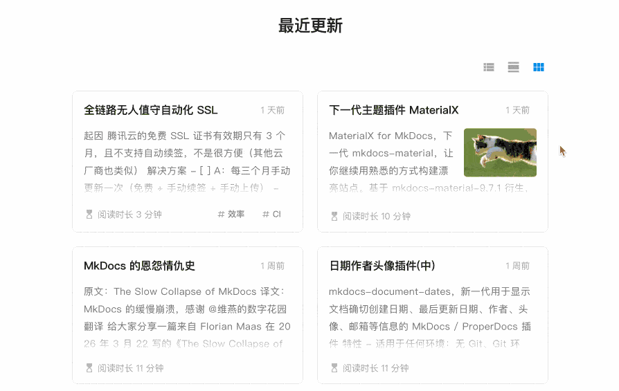

# 最近更新文档列表 - MkDocs 插件

[mkdocs-recently-updated-docs](https://github.com/jaywhj/mkdocs-recently-updated-docs)：一行代码显示最近更新的文档列表

- 按更新时间降序显示最近更新的文档，列表项动态更新
- 支持列表、详情、网格等多种视图模式
- 支持自动提取文章摘要
- 支持在 Front Matter 中自定义文章封面
- 支持自定义显示数量
- 支持排除指定文件或目录
- 适用于任何环境（no-Git, Git, Docker, all CI/CD build systems, etc.）

最新更新模块会以结构化的方式展示站点的文档信息，这非常适合**文档数量众多或更新频繁**的网站，这样读者可以**快速查看最新内容**

