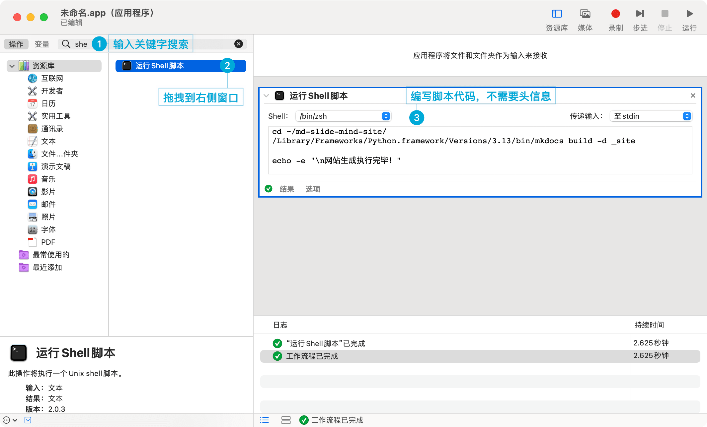

# Mac下自建双击可执行程序

最简单的方式，基于 shell 脚本。


## 一、shell 和 bash

- **Shell**：Linux 和 Unix 系统中的命令行解释器，包含了各种类型（如 sh、bash、csh、ksh、zsh 等）；
- **sh**（Bourne Shell）：早期的标准 Shell，功能简单，适合编写对兼容性有要求的脚本；
- **Bash**（Bourne Again Shell）：sh 的增强版，是 Linux 和 Unix 系统中的默认 Shell；


## 二、编写脚本

新建 `autoexe.sh` 文件，编写 bash 代码，以 `#!/bin/bash` 开头：

```bash
#!/bin/bash

cd ~/Desktop
ls -l

echo -e "\n脚本执行完毕！"
```


## 三、脚本授权

打开 `终端` 输入：`chmod 755 autoexe.sh`


## 四、脚本执行

### 1. 终端执行

- **拖拽执行**：直接拖拽 `autoexe.sh` 到 `终端`，回车即可；
- **双击执行 - 更改打开方式**：选中 `autoexe.sh`，右键 - 显示简介 - 打开方式 - 其他 - 选择 `终端`，然后双击脚本就可以执行了；
- **双击执行 - 改为 command 后缀**：把 `autoexe.sh` 后缀改为 command 后重新授权即可，此时再双击 `autoexe.command` 就可以直接运行了。


### 2. 自动操作

Mac 自带 `自动操作.app` 程序，可将 shell 脚本打包成可执行程序（.app后缀）：

1. 搜索打开 `自动操作.app` 或 `Automator.app`；
2. 选择 `应用程序`，点击 `选取`；
3. 在左侧找到 `运行 Shell 脚本`，直接拖拽到右侧窗口；
4. 在右侧窗口里直接编写脚本代码（不需要 bin 头信息）；
5. 保存为 `autoexe.app`，并授权 `chmod 755 autoexe.app`，即可双击执行。

注意：如果要执行 Python 脚本，一定要指定全路径：

```bash
cd ~/md-slide-mind-site/
/Library/Frameworks/Python.framework/Versions/3.13/bin/mkdocs build -d _site
```

<!--v-->




## 探索 macOS 自动化

参考：

- [善用Mac自动化](https://juejin.cn/post/7021788113668145188)；
- [AppleScript 入门：探索 macOS 自动化](https://sspai.com/post/46912)；
- [MacOS-Automator](https://github.com/sengoku-f/MacOS-Automator)；
