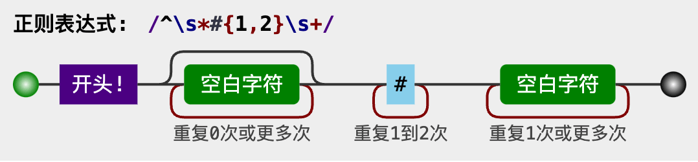
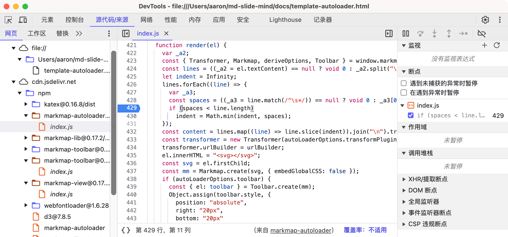

# 实用小工具

- 参考资料：[小工具推荐](https://nav.wiki-power.com/)


## 图像处理

- [IconPark](https://iconpark.oceanengine.com/official)，字节出的免费图标库；
- [AI画室 - 老照片修复](https://www.aihuazuo.com/laozhaopian/)，还有 [黑白照片上色](https://www.aihuazuo.com/shangse/)、模糊人脸修复等；
- [佐糖 - AI 照片修复](https://picwish.cn/create)
- [AI 自动上色](https://petalica.com/index_zh.html)；
- [AI 抠图](https://zh.clippingmagic.com/)；
- AI 图片无损放大：[Upscayl](https://github.com/upscayl/upscayl)、[Bigjpg](https://bigjpg.com/)；
- [AutoDraw](https://www.autodraw.com/)，Google 在线 AI 绘图工具，根据用户的草笔划，自动生成相应的精美简笔画，让用户快速创建出有趣的视觉作品，[使用介绍](https://www.onlinephotosoft.com/zh-CN/autodraw/)；
- [QRBTF](https://github.com/latentcat/qrbtf)，「[QR Code Beautifier](https://qrbtf.com/zh)」，AI & 参数化二维码生成器；


## 翻译工具

- [pot-desktop](https://github.com/pot-app/pot-desktop)，跨平台的 AI 翻译和 OCR 软件，[Pot 官网](https://pot-app.com/)；
- ~~[Easydict](https://github.com/tisfeng/Easydict)，Mac 下的 AI 翻译和 OCR 软件；~~
- [Trancy](https://www.trancy.org/zh-cn)，浏览器插件，AI 网页翻译与视频字幕，支持 Desktop 和 Mobile；
- [沉浸式翻译](https://immersivetranslate.com/)，浏览器插件，AI 网页翻译与视频字幕，支持 Desktop 和 Mobile；
- [欧路词典](https://dict.eudic.net/areas/translation/en/)；


## 爬虫

- [firecrawl](https://github.com/mendableai/firecrawl)，用提示词从任何网站爬取内容并转换为 LLM 结构化数据（爬取 - 抓取 - 清洗）；


## AI图表

- [Napkin](https://www.napkin.ai/)，将文本转换为视觉效果，生成各种图表；
- [Flourish](https://flourish.studio/)，将原始数据转化为交互式可视化数据，让任何数据栩栩如生；


## 在线绘图

- [Draw.io](https://github.com/jgraph/drawio-desktop)，一款开源、免费、强大的在线绘图神器，[在线使用](https://www.drawio.com/)；
- [tldraw](https://github.com/tldraw/tldraw)，白板、无限画布 SDK，[在线使用](https://www.tldraw.com/)；
- [excalidraw](https://github.com/excalidraw/excalidraw)，开源的虚拟手绘风格的白板，集成 AI，[在线使用](https://excalidraw.com/)；


## 网文排版

- [markdown-online-editor](https://github.com/nicejade/markdown-online-editor)，[Arya - 在线 Markdown 编辑器](https://markdown.lovejade.cn/)，支持所有基础语法、数学公式、Mermaid 图表、Echarts 图表、五线谱，以及 PPT 模式、视频音频解析等；
- [md](https://github.com/doocs/md)，[在线微信 Markdown 编辑器](https://doocs.github.io/md/)，支持所有基础语法、数学公式、Mermaid 图表、GFM 警告块；
- [mdx-notes](https://github.com/maqi1520/mdx-notes)，跨平台笔记软件，Web版 [在线编辑器](https://mdxnotes.com/post?id=demo)可作为公众号排版工具，使用 markdown + jsx 结合来排版，[官网介绍](https://mdxnotes.com/)；
- [Markdown2Html](https://github.com/shenweiyan/Markdown2Html)，在线 Markdown 编辑器，支持掘金、知乎、微信公众号，[在线使用 1、](https://md.weiyan.cc/)[在线使用 2](https://markdown.com.cn/editor/)；
- [wenyan](https://github.com/caol64/wenyan)，Markdown 排版美化客户端，参考了 Markdown2Html，支持微信公众号、头条、知乎、掘金等平台；
- [wxmp](https://github.com/jaywcjlove/wxmp)，微信公众号 Markdown 编辑器，[在线使用](https://jaywcjlove.github.io/wxmp)；
- [wechat-format](https://github.com/lyricat/wechat-format)，微信公众号排版编辑器，[在线使用](https://quail.ink/tools/markdown-to-wx/)；
    - [公众号 Markdown 编辑器](http://prod.zkqiang.cn/wxeditor/index.html)，基于 wechat-format 二改；
    - [MD2WeChat](https://md2wechat.wiki-power.com/)，基于 wechat-format 二改；


## Markdown 工具

- [Typora](https://www.typora.io/)（Mac、Win、Linux），简约不简单，所见即所得；
- [YankNote](https://yank-note.com/zh-CN)（Mac、Win、Linux），一款强大可扩展的 Markdown 编辑器，满足了所有幻想，还可以[在线体验](https://demo.yank-note.com/)；
- [markdown-online-editor](https://github.com/nicejade/markdown-online-editor)，[Arya - 在线 Markdown 编辑器](https://markdown.lovejade.cn/)，支持所有基础语法、数学公式、Mermaid 图表、Echarts 图表、五线谱，以及 PPT 模式、视频音频解析等；
- [md](https://github.com/doocs/md)，[在线微信 Markdown 编辑器](https://doocs.github.io/md/)，支持所有基础语法、数学公式、Mermaid 图表、GFM 警告块；


## 手写公式转 LaTeX

- [MyScript Math](https://webdemo.myscript.com/views/math/index.html)：支持手写数学公式，自动转 LaTeX 或 MathML，[MyScript](https://github.com/MyScript/myscript-math-web) 此外还有集成手写框架 [iinkTS](https://github.com/MyScript/iinkTS) 及 iOS、Android 客户端，都很棒；
- [SimpleTex](https://simpletex.cn/)：好用的公式识别编辑神器，提供 [跨平台客户端](https://simpletex.cn/download) 和 [在线体验](https://simpletex.cn/ai/latex_ocr) 供使用；
    - 支持手写、截屏截图、PDF文件的公式识别；
    - 支持80+语言识别、各种类型的复杂公式、化学结构式识别；
    - 支持识别后在**结果上直接编辑**，支持常见 LaTeX 命令补全；
    - 识别结果支持 Markdown 或 LaTeX 格式；


## 前端工具

- 文本工具：Sublime Text、Atom；
- 开发工具：[Cursor](https://www.cursor.com/)、[Visual Studio Code](https://code.visualstudio.com/)、HBuilderX；
- 集成 IDE：WebStorm；
- 在线工具：[CodePen](https://codepen.io/)、JSFiddle、[JS Bin](https://jsbin.com)、CSS Grid Generator；


## 代码执行可视化

- [Python Tutor](https://pythontutor.com/)，一个在线的代码执行过程可视化工具，支持 Python、Java、C、C++ 和 JavaScript；


## 正则表达式可视化

- [Regulex](https://github.com/CJex/regulex)，[在线试用](https://jex.im/regulex/)；
    - [在线体验一](https://www.jyshare.com/front-end/854/)；
    - [在线体验二](https://www.lzltool.cn/RegexVisualizer)；
- [Regex-Vis](https://github.com/Bowen7/regex-vis)，[在线试用](https://regex-vis.com/)；




## 在浏览器中调试

Chrome、Safari 都内置了 Web 调试工具，直接用。步骤参考 [现代 JS 教程：debugging-chrome](https://zh.javascript.info/debugging-chrome)。

### 1. 开发者工具

**Chrome**：<kbd>F12</kbd> 或 <kbd>command</kbd>+<kbd>option</kbd>+<kbd>i</kbd>；
**Safari**：<kbd>command</kbd>+<kbd>option</kbd>+<kbd>i</kbd>；



### 2. 控制台-Console

按 <kbd>Esc</kbd>，底部会弹出一个控制台，可输入命令然后按 <kbd>Enter</kbd> 执行。

### 3. 断点-Breakpoints

步骤参考 [现代 JS 教程：断点（Breakpoints）](https://zh.javascript.info/debugging-chrome#duan-dian-breakpoints)。

**设置开关**：

- 启用/禁用，所有断点；
- 启用/禁用，出现错误时自动暂停脚本执行；
- 打断点；
- 重载页面，<kbd>F5</kbd> 或 <kbd>command</kbd>+<kbd>R</kbd>，观察变化；

<!--v-->

**跟踪执行**：

- 恢复（Resume）：继续执行，快捷键 <kbd>F8</kbd>；
- 下步（Step）：运行下一条指令，快捷键 <kbd>F9</kbd>；
- 跨步（Step over）：运行下一条指令，但不会进入到一个函数中，快捷键 <kbd>F10</kbd>；
- 步入（Step into）：快捷键 <kbd>F11</kbd>；
- 步出（Step out）：继续执行到当前函数的末尾，快捷键 <kbd>Shift</kbd>+<kbd>F11</kbd>；
- Continue to here，在代码中的某一行右键里。当你想要向前移动很多步到某一行为止，但是又懒得设置一个断点时非常的方便；

### 4. debugger命令

可以在代码中用 `debugger` 命令来暂停代码：

```javascript hl_lines="3"
function hello(name) {
    let phrase = `Hello, ${name}!`;
    debugger;  // <-- 调试器会在这停止
    say(phrase);
}
```

这样的命令只有在开发者工具打开时才有效，否则浏览器会忽略它。

### 5. 日志记录

可以在代码中用 `console.log()` 函数输出日志来观察代码执行情况：

```javascript hl_lines="2"
for (let i = 0; i < 5; i++) {
    console.log("value", i);
}
```


## 学习教程

### VS Code

- [Visual Studio Code 中文文档 v1.96](https://vscode.js.cn/docs)；
- [Visual Studio Code 中文文档 v1.84](https://vscode.github.net.cn/docs/)；


### 前端开发

- 系统教程：[现代 JavaScript 教程中文版](https://github.com/javascript-tutorial/zh.javascript.info)，[纯净阅读](https://zh.javascript.info/)；
    - 翻译自 [Modern JavaScript Tutorial](https://github.com/javascript-tutorial/en.javascript.info)；
- 知识库：[千古前端图文教程](https://github.com/qianguyihao/Web)，Web前端入门知识库，[纯净阅读](https://web.qianguyihao.com/)；


### 图解算法

- [Hello 算法](https://github.com/krahets/hello-algo)，动画图解数据结构与算法，500 幅动画图解、14 种编程语言代码，[纯净阅读](https://www.hello-algo.com/chapter_hello_algo/)；
- [Manim](https://github.com/ManimCommunity/manim)，一个由社区维护的用于创建数学动画的 Python 框架。有两个版本，还有最初 [3Blue1Brown](https://www.3blue1brown.com/) 作者维护的 [manim 个人版](https://github.com/3b1b/manim)；


### 数据科学

- [数据科学与教育](https://xiaomaohao.quarto.pub/)，人大副教授 - [叶阳永](https://yypw.netlify.app/about)；


### 教育学

- [叶阳永 - 开设课程](https://yypw.netlify.app/doc_raw/curriculum/)：[教育政治学](https://yypw.netlify.app/doc_raw/curriculum/politics_of_education/)、[教育法律实务](https://yypw.netlify.app/doc_raw/curriculum/practical_law/)，人大副教授2024年的课程；