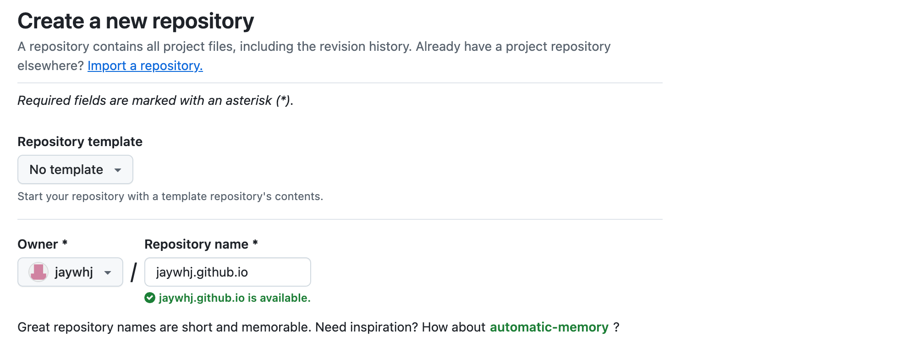
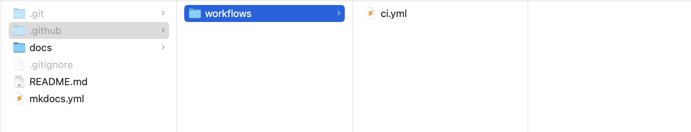

## Markdown 静态网站

静态网站生成工具，选择众多。


### 工具对比

- Hugo：由 Go语言实现的静态网站生成器；
- Jekyll：由 GitHub 联创创建的基于 Ruby 的静态站点生成器；
- Hexo：一个快速、简洁的基于 Node.js 的博客框架；
- VuePress：Vue 驱动的静态网站生成器；
- VitePress：Vite 和 Vue 驱动的静态站点生成器，比 VuePress 更轻更快；
- Docusaurus：基于 React 的静态网站生成器；
- GitBook：一个使用 Git 和 Markdown 来构建书籍的工具；
- MkDocs：一款流行的、基于 Python 的静态网站生成器；

<!--v-->

更多对比参考：

- [2024年Top5静态网站生成器](https://www.learnhard.cn/posts/top5staticwebsitegenerators/)；
- [VuePress文档 - 为什么不是其它 ...?](https://vuepress.vuejs.org/zh/guide/introduction.html#为什么不是)；
- [Docusaurus文档 - 与其他工具对比](https://www.docusaurus.cn/docs#comparison-with-other-tools)；
- [为什么你需要一个知识库](https://wiki-power.com/为什么你需要一个知识库/#_8)；


## 选择 MkDocs

本着**极简易用**、非程序员都会用的原则，毫无疑问选择 [MkDocs](https://www.mkdocs.org/)，一款流行且快速、简单、轻量级的静态网站生成器。

用 Markdown 编写内容，仅通过一个 YAML 文件配置一切。

使用参考：

- [MkDocs 配置说明](https://wcowin.work/Mkdocs-Wcowin/blog/Mkdocs/mkdocs2/)；
- [使用 MkDocs 和 Material 主题搭建技术博客](http://www.cuishuaiwen.com:8000/zh/PROJECT/TECH-BLOG/mkdocs_and_material/)；
- [mkdocs 文档生成](https://www.cnblogs.com/BEMAKE/p/mkdocsTutorials.html)；
- [mkdocs material 超全配置](https://wncfht.github.io/notes/Tools/Blog/Mkdocs_Material/)；


### 1. 安装 MkDocs

```bash
pip3 install mkdocs
pip3 install mkdocs-material    # mkdocs 主题插件
mkdocs new .
mkdocs new mkdocs-project
cd mkdocs-project
mkdocs serve -o
mkdocs build -d _site
```

目录结构：

```bash
$ tree
.
├── docs
│   └──index.md
└── mkdocs.yml
```


### 2. MkDocs 配置

在 `mkdocs.yml` 中配置所有选项，以下为部分参考，完整配置见 [mkdocs.yml](https://github.com/jaywhj/jaywhj.github.io/blob/main/mkdocs.yml)：

```yaml
site_name: My Site
nav:
  - 首页: index.md
  - 实用教程:
    - Markdown实用教程: markdown.md
  - 其他:
    - 花絮: hainan.md
theme:
  language: zh
  palette: 
    - primary: deep orange
    - accent: deep orange
  features:
    - header.autohide   # 自动隐藏header
    - content.code.copy # 复制代码按钮
    - navigation.expand # 默认展开导航栏
    - navigation.footer # 底部导航栏
plugins:
  - search
  - tags
```


### 3. 插件与扩展

[MkDocs 项目和插件列表](https://github.com/mkdocs/catalog)：

- 主题文档插件：[mkdocs-material](https://github.com/squidfunk/mkdocs-material)；
- 添加日期：[mkdocs-git-revision-date-localized-plugin](https://github.com/timvink/mkdocs-git-revision-date-localized-plugin)；
- 思维导图：[mkdocs-markmap](https://github.com/markmap/mkdocs-markmap)；
- 绘图插件：
    - [mkdocs-mermaid2-plugin](https://github.com/fralau/mkdocs-mermaid2-plugin)；
    - [plantuml-markdown](https://github.com/mikitex70/plantuml-markdown)；
    - [mkdocs-drawio-exporter](https://github.com/LukeCarrier/mkdocs-drawio-exporter)；
    - 大集合：[mkdocs-kroki-plugin](https://github.com/AVATEAM-IT-SYSTEMHAUS/mkdocs-kroki-plugin)；
- 图表插件：
    - [Vega-Lite](https://vega.github.io/vega-lite/examples/)：[mkdocs-charts-plugin](https://github.com/timvink/mkdocs-charts-plugin)；
    - 最强 Python 图表库 [Plotly.js](https://plotly.com/javascript/)：[mkdocs-plotly-plugin](https://github.com/legendof-selda/mkdocs-plotly-plugin)；
- 图片灯箱特效：[mkdocs-glightbox](https://github.com/blueswen/mkdocs-glightbox)；
- 读取各种表格到页面：[mkdocs-table-reader-plugin](https://github.com/timvink/mkdocs-table-reader-plugin)；


## 使用插件 Material

[Material for MkDocs](https://github.com/squidfunk/mkdocs-material)，一个基于 MkDocs 的强大的文档框架，能让你在几分钟内创建一个专业的静态网站，可搜索、可定制，支持 60 多种语言，适配所有设备。


### 1. 微调与定制

参考 [Material 官方文档](https://squidfunk.github.io/mkdocs-material/)：

- [Setup](https://squidfunk.github.io/mkdocs-material/setup/)；
- [Customization](https://squidfunk.github.io/mkdocs-material/customization/)；


### 2. 添加评论系统

参考文档：

- [Adding a comment system](https://squidfunk.github.io/mkdocs-material/setup/adding-a-comment-system/)；
- [添加评论系统(Giscus为例)](https://wcowin.work/Mkdocs-Wcowin/blog/websitebeauty/mkcomments/)；

#### 使用 Giscus

[Giscus](https://giscus.app/zh-CN) 利用 [GitHub Discussions](https://docs.github.com/zh/discussions) 模块实现评论系统，让访客借助 GitHub 在网站里留言评论。

1. 在 `docs/` 下新建覆写文件 `comments.html`，路径如下：`docs/overrides/partials/comments.html`；
2. 在 `mkdocs.yml` 中配置覆写文件夹 `overrides` 路径；
3. 在 GitHub 中新建仓库，切换到该仓库的 Settings 中，打开 Discussions 开关；
4. 安装 [Giscus GitHub App](https://github.com/apps/giscus) 应用程序，并授予它访问该仓库 Discussions 的读写权限；
5. 打开 [Giscus](https://giscus.app/zh-CN)，按提示走配置流程，最终会生成一段脚本代码，复制它并嵌入 `comments.html` 中；
6. 在需要评论的页面，添加头信息 `comments: true` 即可。

#### 使用 Twikoo

[Twikoo](https://github.com/twikoojs/twikoo)，一个简洁、安全、免费的静态网站评论系统，配置参考 [Twikoo 文档](https://twikoo.js.org/intro.html)。


### 3. 添加更新时间戳

为页面添加最后更新日期，参考：

- [mkdocs-git-revision-date-localized-plugin](https://github.com/timvink/mkdocs-git-revision-date-localized-plugin)；
- [添加文章修订时间戳](https://wcowin.work/Mkdocs-Wcowin/blog/websitebeauty/time/)；


## 网站部署 GitHub Pages

使用 GitHub Pages 来托管网站，具体参考 [GitHub Pages 文档](https://docs.github.com/zh/pages)；

### 1. 创建网站 GitHub 仓库

- New repository，仓库名建议为 `<username>.github.io`，比如我的是：`jaywhj.github.io`；


### 2. 本地 VCS 关联 GitHub 仓库

- 在命令行上创建一个新版本库
    ```bash
    echo "# jaywhj.github.io" >> README.md
    git init
    git add README.md
    git commit -m "first commit"
    git branch -M main
    git remote add origin https://github.com/jaywhj/jaywhj.github.io.git
    git push -u origin main
    ```
- 从命令行推送现有版本库
    ```bash
    git remote add origin https://github.com/jaywhj/jaywhj.github.io.git
    git branch -M main
    git push -u origin main
    ```
- 从 URL 或服务克隆版本库
    ```bash
    git clone https://github.com/jaywhj/jaywhj.github.io.git
    ```

### 3. MkDocs 项目初始化(可选)

1. 打开终端，切换到本地仓库根目录 `jaywhj.github.io`，执行 `mkdocs new .` 生成 MkDocs 项目文件，此外还可以新建 `README.md` 文件；
2. `Commit` 并 `Push` 到 GitHub 仓库；

异常处理：

- **Author identity unknown**：需要设置 Git 的用户名和邮箱，用来标识提交者的身份，可随意配置；      
    ```bash
    git config --global user.name "Your Name"  
    git config --global user.email "you@example.com"
    ```
- **Push 验证失败**：需配置 `Personal Access Token`，GitHub 在 2021 年 8 月不再支持使用用户名和密码的方式访问仓库，需要使用用户名和访问 Token 的方式，步骤参考 [配置 Personal Access Token](https://juejin.cn/post/7144638247346372621)；

### 4. 网站部署

可选择手动或自动部署，手动方式操作简单，但每次更新都需要手动操作一次，自动方式配置复杂，但是一劳永逸。

- [ ] 补充区别流程图

#### 手动部署

只需从包含 `mkdocs.yml` 的目录中调用以下命令即可：

```bash
mkdocs gh-deploy --force
```

该命令执行了以下动作：

1. 清理 MkDocs 生成的站点 `site` 目录；
2. 执行 `mkdocs build` 命令，重新构建文档到 `site` 目录（将 Markdown 文件转换成 HTML 静态网页）；
3. 拷贝 `site` 目录的内容到 `gh-pages` 分支并推送到 GitHub；

完成部署之后，你网站的 HTML 文件都部署在了 gh-pages 分支。而源文件（Markdown 文件）push 到 Github 仓库是可选的，因为网站只需要 HTML 文件即可，如果提交了源文件，则在 `main` 分支。

#### 工作流自动部署

一、配置工作流权限：

- 进入仓库 - `Settings` - `Actions` - `General`，将 `Workflow permissions` 设置为 `Read and write permissions`，点击 `Save` 保存设置；

二、创建 GitHub Actions 工作流：

1. 在本地仓库根目录下创建工作流配置文件，路径为 `.github/workflows/ci.yml`；
    ```bash
    mkdir -p .github/workflows
    cd .github/workflows
    vim ci.yml
    ```
    
2. 复制 [Material - GitHub Actions](https://squidfunk.github.io/mkdocs-material/publishing-your-site/#with-github-actions) 中的模板内容到上一步创建的文件中保存；
3. `Commit` 并 `Push` 到 GitHub 仓库；

三、补充插件依赖(可选)

如果你的 MkDocs 安装了除 `mkdocs-material` 外的其它插件或库，（比如 `mkdocs-glightbox`），那你得在 `ci.yml` 中配置这些安装依赖（高亮行）；

```bash {h1_lines="14 15 30"}
name: ci 
on:
  push:
    branches:
      - master 
      - main
permissions:
  contents: write
jobs:
  deploy:
    runs-on: ubuntu-latest
    steps:
      - uses: actions/checkout@v4
        with:
          fetch-depth: 0
      - name: Configure Git Credentials
        run: |
          git config user.name github-actions[bot]
          git config user.email 41898282+github-actions[bot]@users.noreply.github.com
      - uses: actions/setup-python@v5
        with:
          python-version: 3.x
      - run: echo "cache_id=$(date --utc '+%V')" >> $GITHUB_ENV 
      - uses: actions/cache@v4
        with:
          key: mkdocs-material-${{ env.cache_id }}
          path: .cache
          restore-keys: |
            mkdocs-material-
      - run: pip install mkdocs-glightbox
      - run: pip install mkdocs-material 
      - run: mkdocs gh-deploy --force
```

### 5. 配置 GitHub Pages 发布源

进入仓库 - `Settings` - `Pages`，将 `Build and deployment` 下 `Branch` 设置为 `gh-pages/(root)`，点击 `Save` 保存设置；

### 6. 验证网站

进入仓库 - `Settings` - `Pages`，在 `GitHub Pages` 中能看到网站地址：`https://jaywhj.github.io/`，可直接点击右边的 `Visit site` 访问网站；

### 自定义域名(可选)

在 `docs` 文件夹中创建一个 `CNAME` 文件，内容写上你的自定义域名；

### 参考

- [Publishing your site](https://squidfunk.github.io/mkdocs-material/publishing-your-site/)；
- [mkdocs部署静态网页至GitHub](https://wcowin.work/Mkdocs-Wcowin/blog/Mkdocs/mkdocs1/)；
- [GitHub Pages 文档自动化部署 - MkDocs](https://blog.arisa.moe/blog/2022/220407-github-pages/)；
- [使用MkDocs搭建个人博客](https://www.cnblogs.com/chinjinyu/p/17610438.html)；
- [MkDocs - 部署WiKi站点到Github Pages](https://edgeai-lab.github.io/notebook/Tools/mkdocs/mkdocs_deploy_githubpages/)；